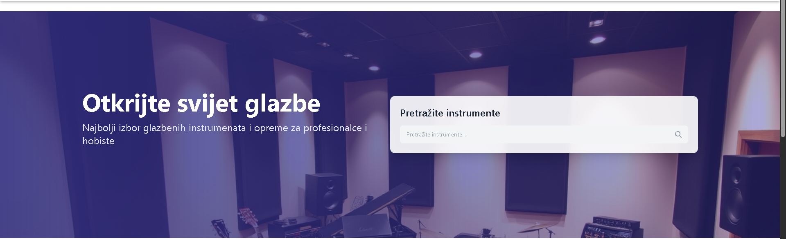
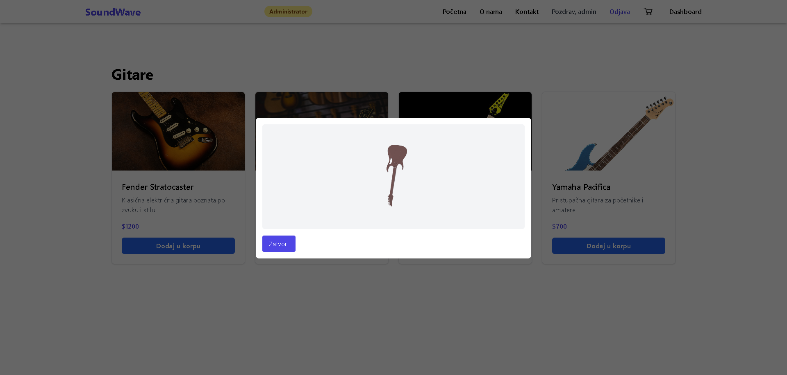
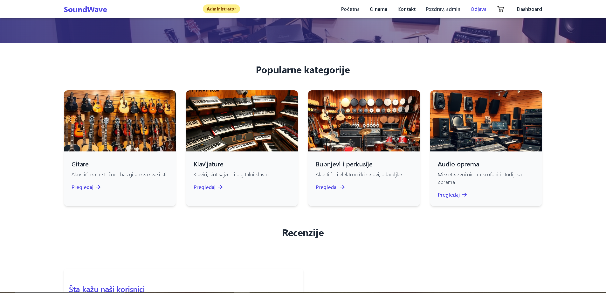
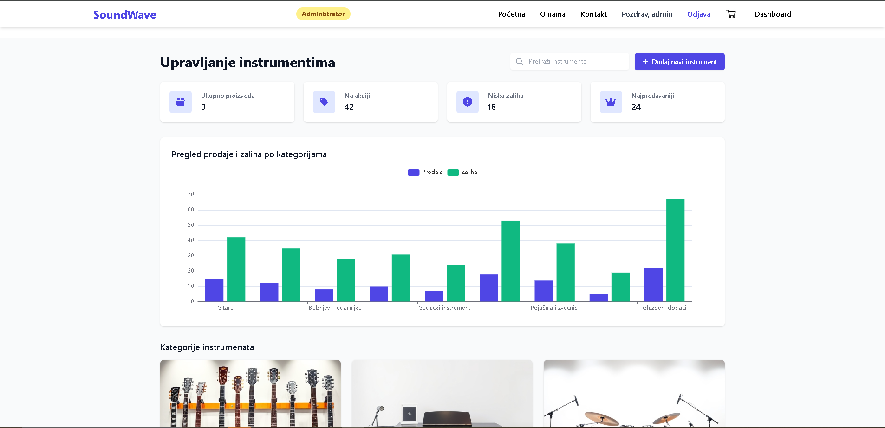

# 🎸 Prodavnica Muzičkih Instrumenata

Ovo je web aplikacija za online prodaju muzičkih instrumenata. Korisnici mogu pregledati ponudu instrumenata, dodati proizvode u korpu, kreirati nalog i izvršiti kupovinu.

---

## 🛠️ Tehnologije korištene u projektu

- **React** – za kreiranje korisničkog interfejsa
- **Tailwind CSS** – za brzu i responzivnu stilizaciju
- **THREE JS** – za 3D prikaz instrumenata prije kupovine

---

## 📁 Struktura projekta

src/
│
├── components/ # Reusable UI komponente (npr. Navbar, ProtectedRoute)
├── context/ # Globalni konteksti (npr. korpa, korisnik)
├── pages/ # Stranice aplikacije (Home, About, itd.)
│
├── App.jsx # Glavna komponenta aplikacije
└── main.jsx # Ulazna tačka aplikacije

yaml
Copy
Edit

---

## 👥 Uloge korisnika

- **Gost (neulogovani korisnik):**
  - Može vidjeti ko smo i napraviti račun

- **Registrovani korisnik:**
  - Pristup svim funkcijama kao i gost
  - Mogućnost pregleda instrumenata
  - Pregled i upravljanje korpom
  - Započinjanje i finalizacija kupovine

- **Admin (buduće proširenje):**
  - Dodavanje/brisanje proizvoda
  - Upravljanje narudžbama i korisnicima

---

## ▶️ Upute za pokretanje projekta lokalno

1. Klonirajte repozitorij:
```bash
git clone https://github.com/kaechesbord/DWS_Projekt.git
Uđite u direktorij projekta:

cd naziv-projekta
Instalirajte zavisnosti:


npm install
Pokrenite razvojni server:

npm run dev ILI
npm start

```
2. Pokretanje servera:
```bash
npm install -g json-server   
npx json-server --watch db.json --port 5000
```
Otvorite u pretraživaču:


